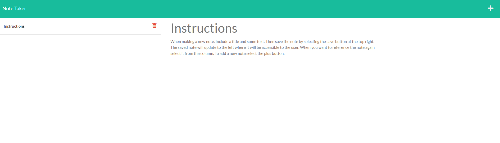

# Note-Taker

## Description

In this application you will be given the ability to write and save notes using Express.js. If you want to keep 

the note, use the save button that appears next to the plus button. Once the  save button is selected the 

saved note will update to the left of the screen. This is Where you have the option to view and edit the note. 

---

## Application

Homepage

Instructions

New Entry

To access Note-Taker click the link below

<https://note-taker07-28-22.herokuapp.com/>

---

## Tools Used

* Node.js

* Express.js

* Npm
  * nodemon
  * path
  * fs

* Insomnia

* Heroku

---

## Contact Information

Matthew Castoreno

Email: <matthew.castoreno@yahoo.com>

Linkedin: <https://www.linkedin.com/in/matthew-castoreno-4973a923b/>